# Home Automation Project

A small project that simulate a home automation using the MQTT protocol, made as homework of the discipline of Distributed Systems at UFMA.

É um protocolo de mensagens que foi
criado com o objetivo de oferecer um
baixo consumo de rede, banda e
também dos demais recursos de
software. O formato utilizado no
MQTT é de Cliente/Servidor.

## MQTT - Message Queuing Telemetry Transport

MQTT is a messaging protocol that was created to offer low consumption of network, bandwidth, and also other software resources. The architecture used in MQTT is Client/Server.

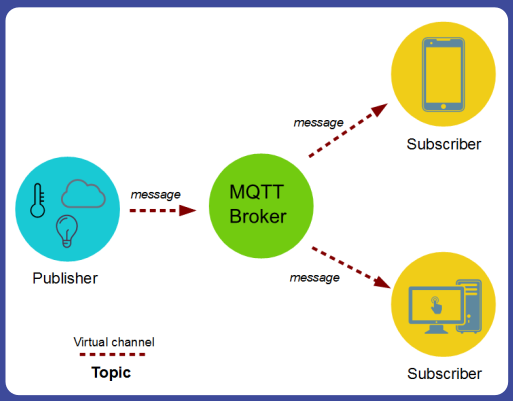

To work, the MQTT protocol uses a publish/subscribe model where it allows the client to post and/or capture information while the server(MQTT broker) will manage the sending and receiving of the respective data.

## Materials:
  * [Arduino IDE 2.0](#read-more)
  * [MQTT](#read-more)
  * [Eclipse Broker](#read-more)
  * [ESP8266](#read-more)
  * Breadboards
  * Jumpers
  * Relay
  * Lamp
  * DHT11
  * Level sensor
  * Push button

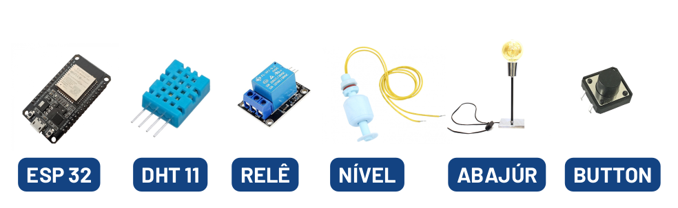

## Description

The project uses four `ESP8266`, one as subscriber and three as publisher sensors. The publisher are: the DHT11 which measure temperature and humidity, a sensor to check the water level, and one to check the light switch state.
Each publisher is an MQTT client and publishes your data on a specific topic. The subscriber can subscribe to topics provided by the publishers and monitor each message published.

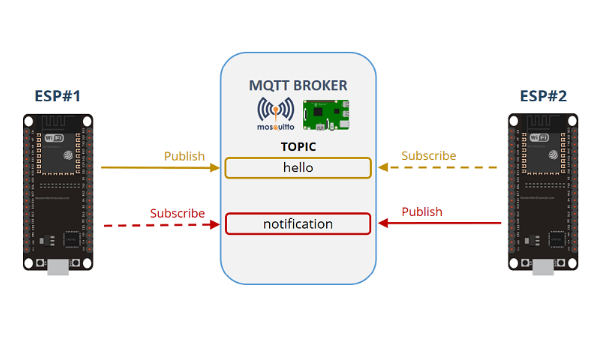

In the specific case of this project, we will use the ESP8266 modules to subscribe and publish messages for the Mosquitto broker. And it can be found at: https://iot.eclipse.org/projects/sandboxes/

## Instructions

### Installing the ESP8266 in Arduino IDE

1. Copy the link: http://arduino.esp8266.com/stable/package_esp8266com_index.json
2. In IDE: `File > Preferences`:
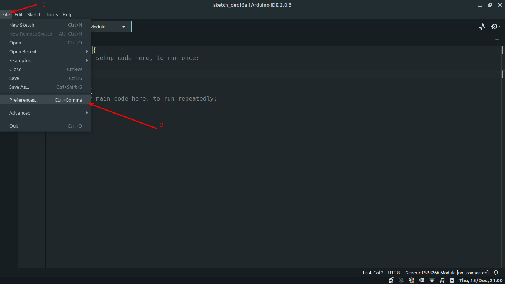
3. Paste the link in `Additional boards manager URLs`:
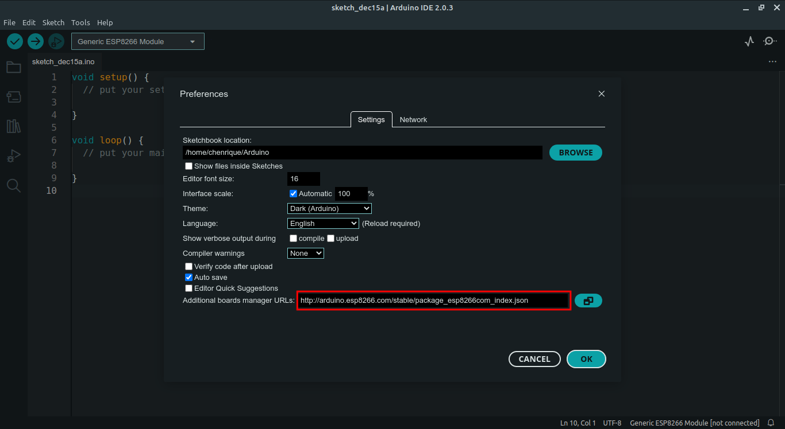
4. Click `OK`
5. Next navigate util `Tools > Board > Boards Manager`:
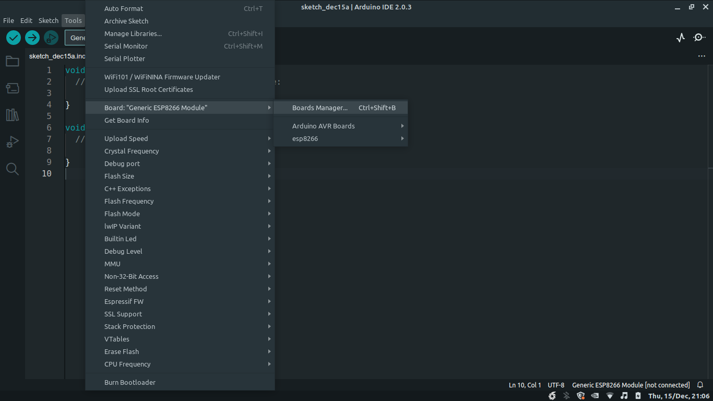
6. Search for `esp8266`:
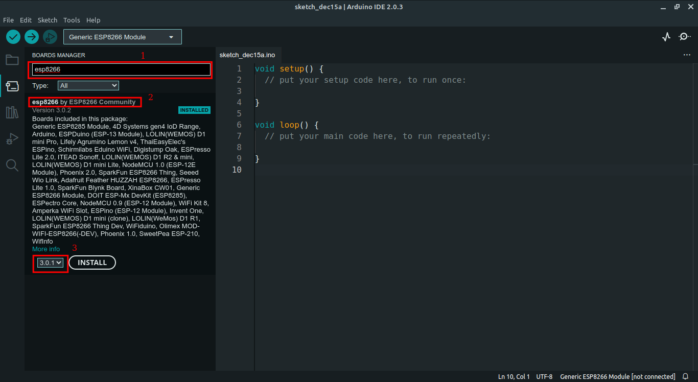
7. Install the `esp8266 by ESP8266 Community`
8. **Great, You are now ready to run the project.**

## Run the project

#### 1. Clone the project
```sh
git clone git@github.com:cHenrique0/mqtt-protocol.git
```

### 3. WiFi connection

Set up your WiFi info at the beginning of each `.ino` file:
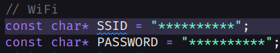
In the start of each file `.ino`

#### 2. Mounting the circuits

##### 2.1 Subscribe

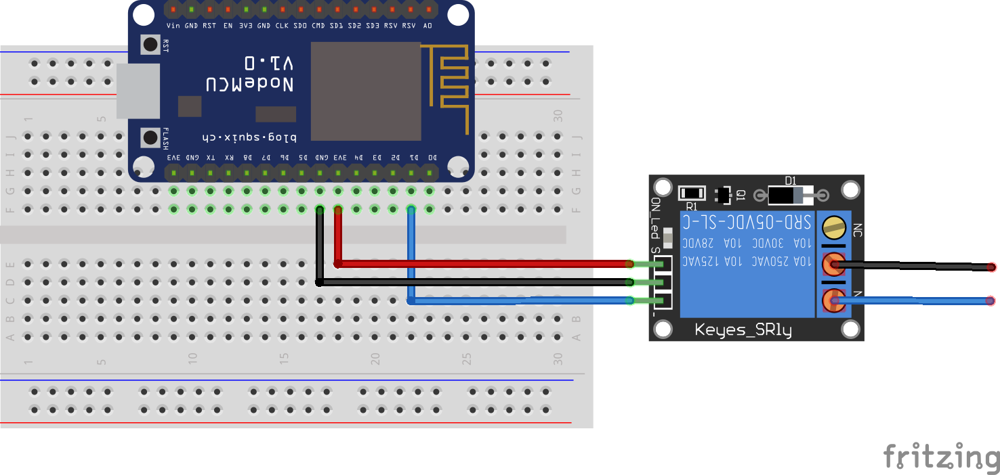

##### 2.2 Lamp Publisher

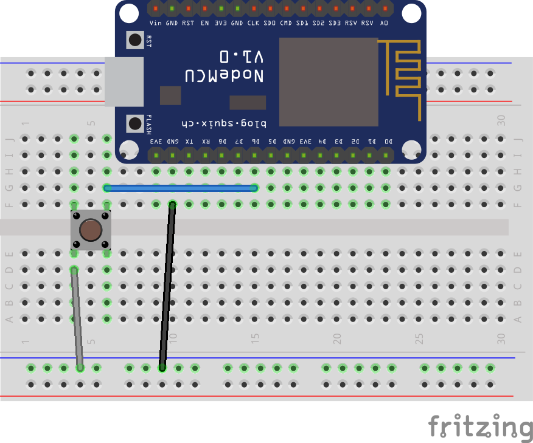

##### 2.3 Temperature and Humidity Publisher

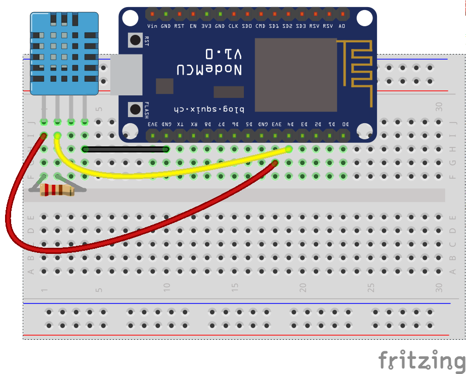

#### 3. Upload the code to ESP8266 modules

#### 4. Open the Serial to monitoring the MQTT in action

## Read more <a id="read-more"></a>
* [Arduino](https://www.arduino.cc/en/software)
* [MQTT](https://mqtt.org/)
* [Eclipse](https://www.arduino.cc/en/software)